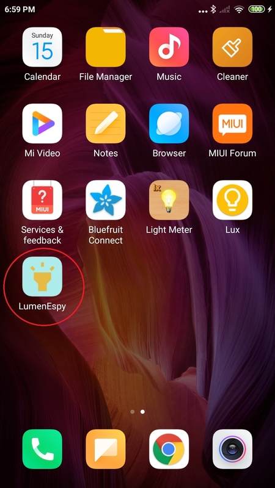
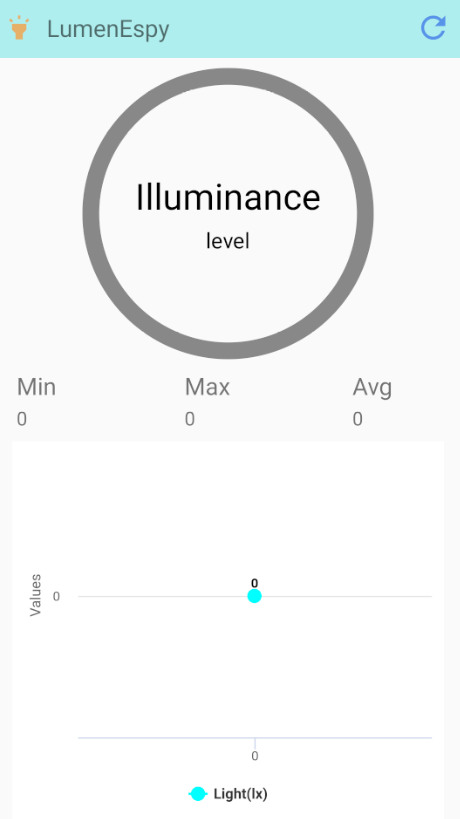
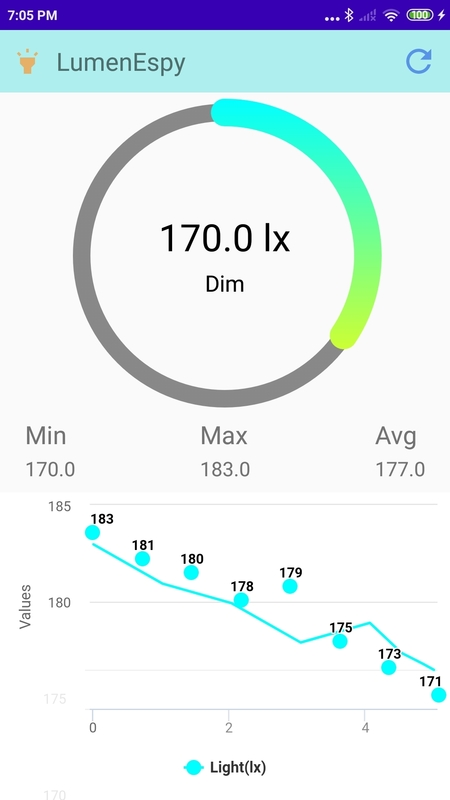

#  LumenEspy 

LumenEspy is a easy to use and simple light meter for measuring illuminance (lx) by using the light sensor of your android device. This app is designed for readers that wants to protect their eyes when they read. This app tells you if the surrounding light is suitable for reading or not.

Key Features:

  - shows the maximum, minimum and average illuminance of your surroundings
  - shows warnings and suggestions based on the illuminance data
  - colorful gradient progress bar
  - shows sensor data in a dynamic graph
  - refresh button for easy callibration

# Instructions

1. Once the app is installed, click on the LumenEspy app as shown as below.

2. Then the app should pop up as shown as below.

3. You might not see the image above because the app runs as soon as it is started. Hence, you should see the progress bar, dynamic graph, illuminance, and level changing along with the light sensor data.

4. The app will change and react based on the intensivity of the surrounding light. Below shows what happens when you run the app.

# Developer
- Jia Jie Choong
